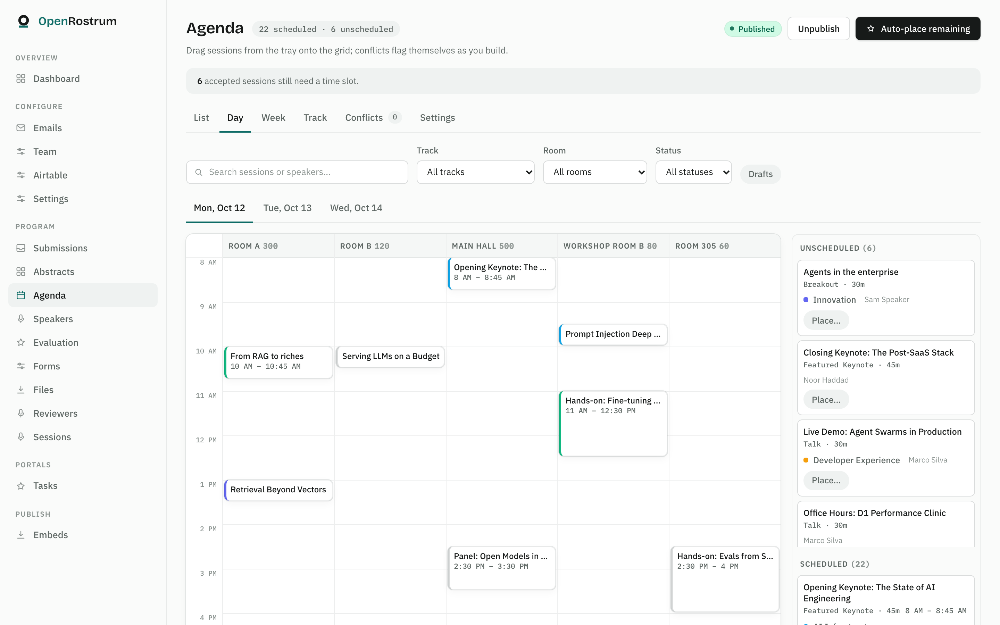
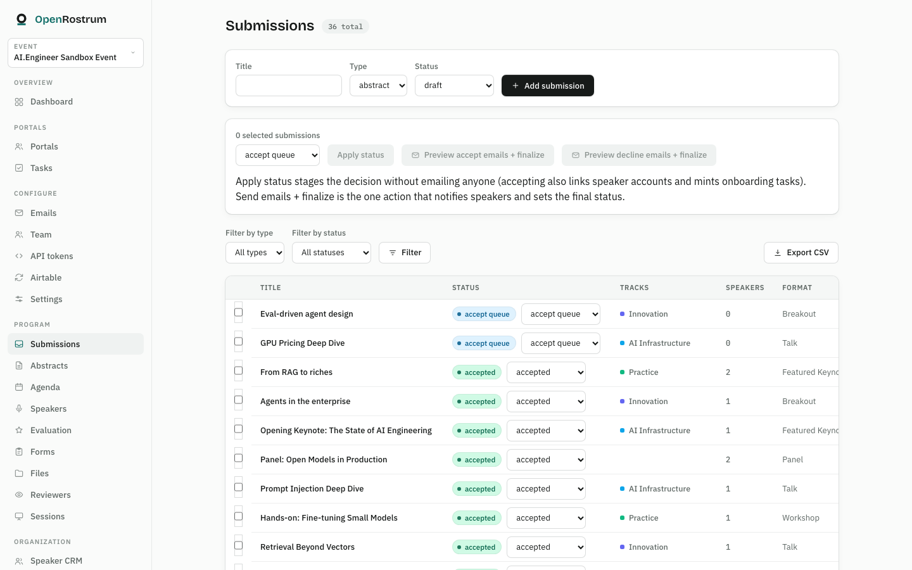
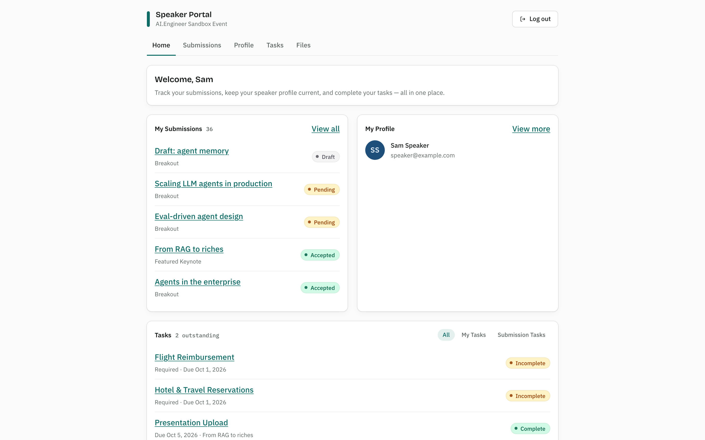
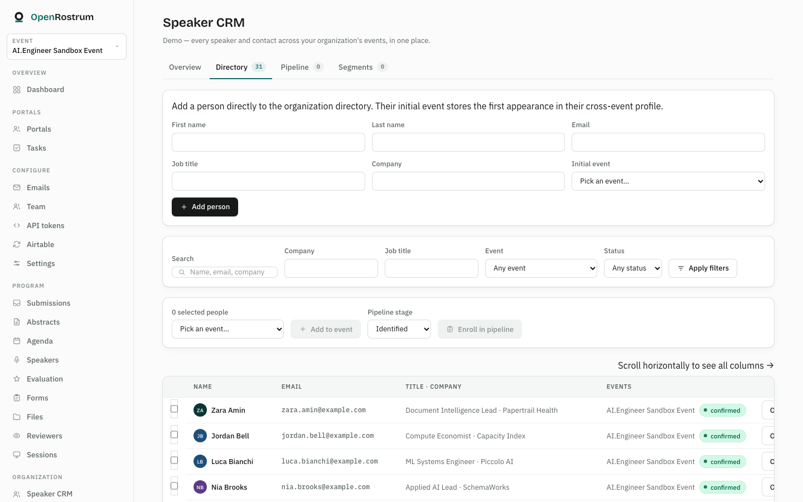

<div align="center">
  
  <h1>OpenRostrum</h1>
  <p><strong>The open-source Sessionboard alternative.</strong><br>
  Conference speaker, session, and program management — free, self-hostable, and yours to keep.</p>
  <p><a href="https://openrostrum.com">openrostrum.com</a> · <a href="#quick-start">Quick start</a> · <a href="#deploy-your-own">Deploy your own</a></p>
  <p>
    <a href="https://github.com/openrostrum/openrostrum/actions/workflows/ci.yml"></a>
    <a href="LICENSE"></a>
  </p>
</div>

<a href=".github/media/agenda-builder.png"></a>
<p align="center"><sub>The agenda builder: schedule on the day × room grid, work through the unscheduled tray, and publish when the program is ready.</sub></p>

## What it does

OpenRostrum runs the program side of a conference, end to end:

- **Call for speakers** 
- **Submission review**
- **AI review**
- **Speaker CRM**
- **Speaker portals**
- **Speaker comms**
- **Agenda building**
- **Task tracking**
- **Public program**
- **Self-serve organizer setup**
- **Airtable sync**
and more...

| Submission review | Speaker portal |
|---|---|
|  |  |
| Review the pipeline, then preview and send decision emails explicitly. | Invited speakers manage submissions, profile, tasks, and files. |

| Speaker CRM directory |
|---|
|  |
| Search the organization-wide directory, assign contacts to events, and enroll prospects into the sourcing pipeline. |

See it running at [openrostrum.com](https://openrostrum.com). The public [schedule](https://openrostrum.com/schedule/northbound-ai-summit-2026), [speakers](https://openrostrum.com/speakers/northbound-ai-summit-2026), and [sessions](https://openrostrum.com/sessions/northbound-ai-summit-2026) pages require no account; the schedule appears after an organizer publishes the agenda. Bare aliases such as `/schedule` redirect to the default event.

## Quick start

Local development needs [pnpm](https://pnpm.io) and Node 20+ (CI runs Node 24):

```bash
pnpm install
pnpm db:reset   # wipe → migrate → seed the local D1 database
pnpm dev        # http://localhost:5173
```

After `pnpm db:reset`, sign in at `/login` with organizer `admin@example.com` / `password`. Speaker `speaker@example.com` and reviewer `reviewer@example.com` use the same password.

## Documentation

| Topic | Where |
|---|---|
| Data model (events, submissions, speakers, sessions) | [`docs/data-model.md`](docs/data-model.md) |
| Design system | [`docs/rules/design-system.md`](docs/rules/design-system.md) |
| Airtable sync design | [`docs/airtable-sync-design.md`](docs/airtable-sync-design.md) |
| Runtime observability (events, timings, log queries) | [`docs/observability.md`](docs/observability.md) |

## Contributing

Conventions live in [`docs/rules/`](docs/rules/); `pnpm verify` runs the full check (typecheck, lint, tests in workerd against real D1) — CI runs the same gate on every PR.

## License

[MIT](LICENSE)
